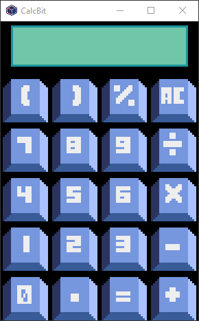

  <h4>🚧⚠️Em desenvolvimento...⚠️🚧</h4>
  <figure>
     
    <figcaption>Aba/Interface do Calcbit</figcaption>
  </figure>

  <h3>Sobre o projeto</h3>
  
Calcbit é uma calculadora simples com o ambiente gráfico no estilo de pixel art, com seu sistema feito em python utilizando o módulo pyxel.

  

    
    
  

  <!--

    
    
    Tagpyxel / version
  

  
  

      
      
      
      
    
  
-->

  <h3>Resultado</h3>
  

